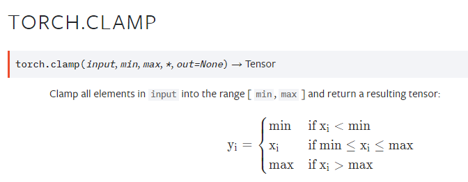
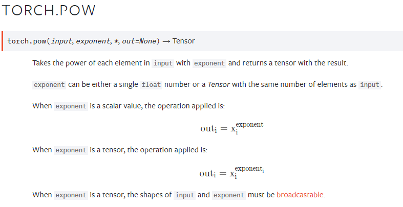
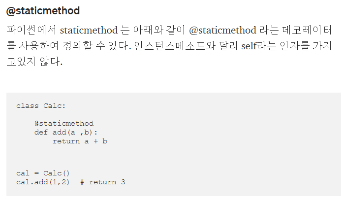
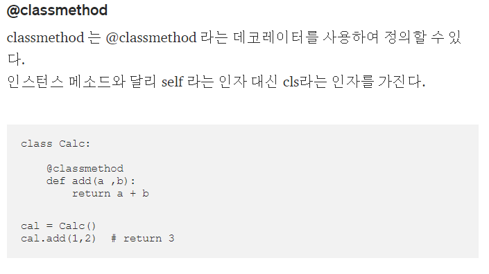
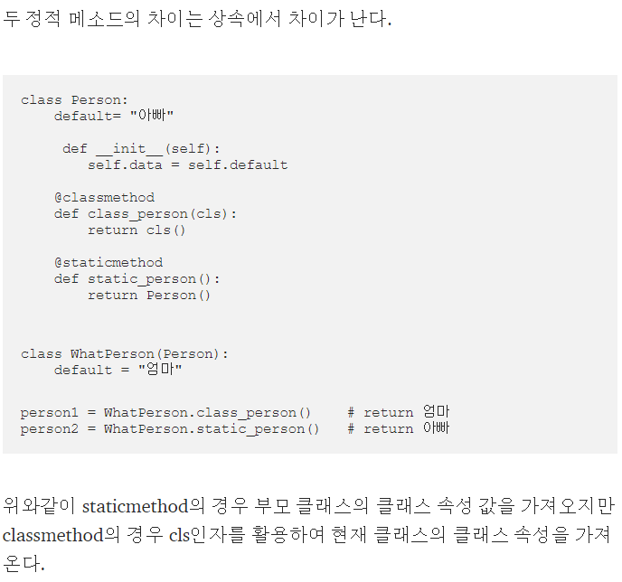

> torch mm, bmm, matmul 차이

- mm : matrix multiplication  
  [n, m] x [m, p] = [n, p] 를 구현
- bmm : batch matrix multiplication, 두 operand가 모두 batch일 때 사용  
  [B, n, m] x [B, m, p] = [B, n, p]
- matmul: 벡터의 내적

> torch clamp

> torch pow

> staticmethod(정적메소드)와 classmethod

- 정적메소드는 클래스에서 직접 접근할 수 있는 메소드이다.
- 파이썬에서 클래스에서 직접 접근할 수 있는 메소드가 @staticmethod 와 @classmethod 두가지가 있다.
- 파이썬에서는 정적메소드임에도 불구하고 인스턴스에서도 접근이 가능하다.

**staticmethod**

**classmethod**

**staticmethod와 classmethod 차이**

- 출처 : https://medium.com/@hckcksrl/python-%EC%A0%95%EC%A0%81%EB%A9%94%EC%86%8C%EB%93%9C-staticmethod-%EC%99%80-classmethod-6721b0977372